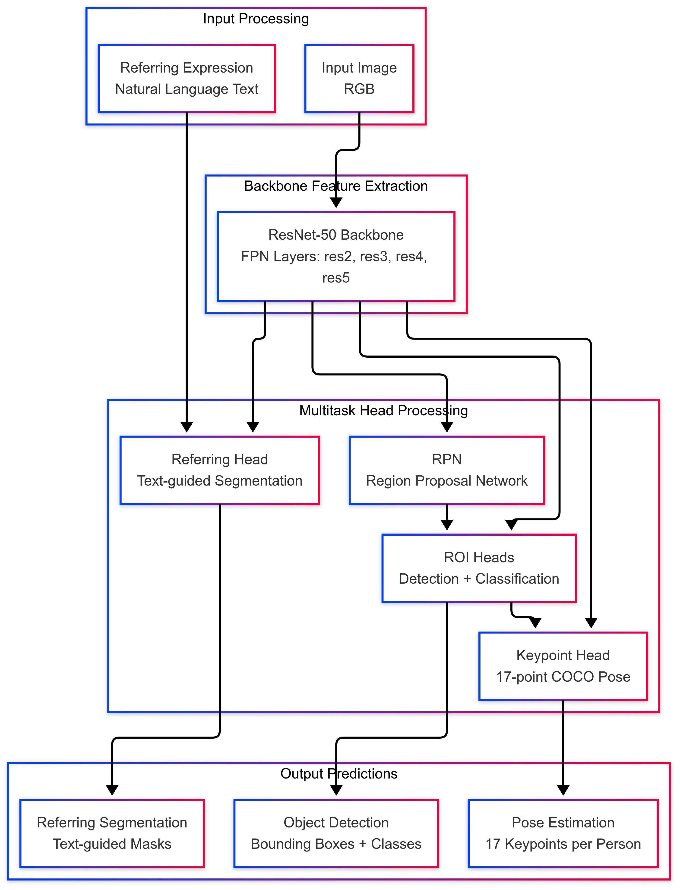
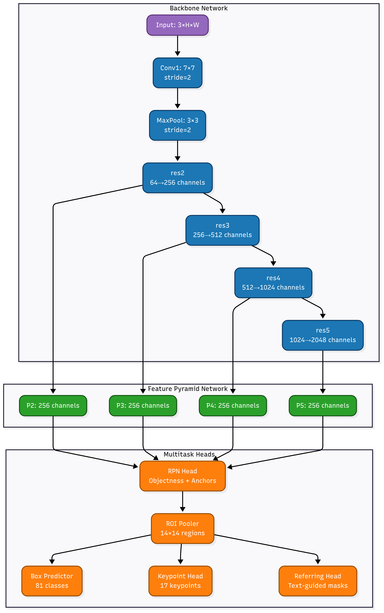
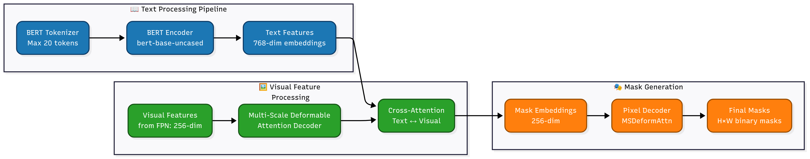
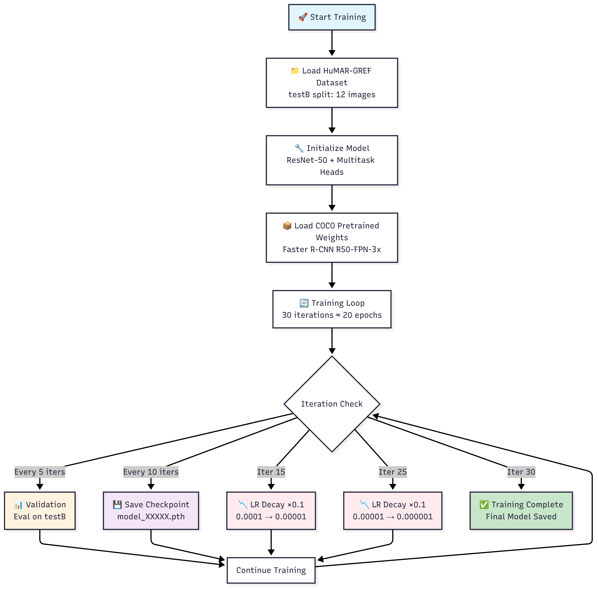

# HuMAR-GREF: Multitask Referring Expression Learning with Human Motion and Action Recognition

[](https://pytorch.org/)
[](https://www.python.org/downloads/)
[](https://detectron2.readthedocs.io/)

> **A comprehensive multitask learning framework combining referring expression segmentation with human pose estimation and action recognition on the HuMAR-GREF dataset.**

---

## 🎯 **Project Overview**

This project implements a **multitask learning framework** that simultaneously performs:
1. **Object Detection** - Detecting people in images
2. **Referring Expression Segmentation** - Segmenting specific people based on natural language descriptions
3. **Human Pose Estimation** - Estimating 17-point COCO keypoints for human pose analysis

The model is trained on the **HuMAR-GREF dataset**, which provides referring expressions for human motion and action recognition tasks.

### 🚀 **Key Features**
- ✅ **Multitask Architecture**: Single model handles detection, segmentation, and pose estimation
- ✅ **Clean Training Pipeline**: Tqdm progress bars with real-time metrics monitoring
- ✅ **Modular Design**: Easy to extend with additional tasks
- ✅ **Optimized Training**: 20-epoch configuration with frequent validation
- ✅ **Comprehensive Evaluation**: Validation every 3.3 epochs with detailed metrics

---

## 📊 **Dataset Information**

### **HuMAR-GREF Dataset Structure**
```
HuMAR-GREF/
├── train/      # 29,304 referring expressions (not used in current config)
├── val/        # 562 samples for validation
├── testA/      # 489 samples for larger experiments  
└── testB/      # 12 samples for rapid prototyping (current config)
```

### **Current Configuration**
- **Training Split**: testB (12 images, 63 person instances)
- **Validation Split**: testB (same as training for rapid iteration)
- **Annotations**: Referring expressions, bounding boxes, segmentation masks, keypoints

---

## 🏗️ **Model Architecture**

### **Overall System Architecture**


### **Detailed Network Architecture**

<p align="center">
  
</p>


### **Referring Expression Segmentation Head**

<p align="center">
  
</p>

### **Multitask Loss Computation**

<p align="center">
  
</p>

---

## 🔧 **Training Pipeline**

### **Training Flow**

<p align="center">
  
</p>

### **Validation Metrics Timeline**

| **Iteration** | **Epoch** | **Event** | **Metrics Reported** |
|---------------|-----------|-----------|----------------------|
| 5 | 3.3 | First Validation | Det_Loss, Seg_Loss, Pose_Loss, Det_Acc, Seg_IoU, Pose_Acc |
| 10 | 6.7 | Validation + Checkpoint | All metrics + model saved |
| 15 | 10.0 | **LR Decay** + Validation | All metrics + LR: 0.0001→0.00001 |
| 20 | 13.3 | Validation + Checkpoint | All metrics + model saved |
| 25 | 16.7 | **LR Decay** + Validation | All metrics + LR: 0.00001→0.000001 |
| 30 | 20.0 | **Training Complete** | Final evaluation + model saved |

---

## 🎮 **Training Configuration**

### **Solver Settings**
```yaml
SOLVER:
  IMS_PER_BATCH: 8          # Process 8 images per batch
  BASE_LR: 0.0001           # Conservative learning rate
  STEPS: (15, 25)           # LR decay at epochs 10 and 16.7
  MAX_ITER: 30              # Total iterations ≈ 20 epochs
  WARMUP_ITERS: 3           # Warmup for first 2 epochs
  OPTIMIZER: "ADAMW"        # AdamW optimizer with weight decay
  WEIGHT_DECAY: 0.05        # L2 regularization
  CHECKPOINT_PERIOD: 10     # Save every ~6.7 epochs
```

### **Dataset Configuration**
```yaml
DATASETS:
  TRAIN: ("humar_gref_testB",)  # 12 training samples
  TEST: ("humar_gref_testB",)   # 12 validation samples

TEST:
  EVAL_PERIOD: 5              # Validate every 3.3 epochs
```

### **Model Configuration**
```yaml
MODEL:
  BACKBONE:
    NAME: "build_d2_resnet_backbone"
  RESNETS:
    DEPTH: 50
    OUT_FEATURES: ["res2", "res3", "res4", "res5"]
  
  KEYPOINT_ON: True           # Enable pose estimation
  ROI_KEYPOINT_HEAD:
    NUM_KEYPOINTS: 17         # COCO-style keypoints
    
  WEIGHTS: "detectron2://COCO-Detection/faster_rcnn_R_50_FPN_3x/137849458/model_final_280758.pkl"
```

---

## 🚀 **Getting Started**

### **Prerequisites**
```bash
# System Requirements
- CUDA 11.8+
- Python 3.12+
- PyTorch 1.11.0+
- Detectron2 0.6+
```

### **Installation**

1. **Clone the repository**
```bash
git clone https://github.com/Nikhil-Rao20/HuMAR.git
cd HuMAR
```

2. **Install Detectron2**
```bash
# Follow official Detectron2 installation guide
pip install detectron2 -f https://dl.fbaipublicfiles.com/detectron2/wheels/cu118/torch1.11/index.html
```

3. **Install dependencies**
```bash
pip install -r requirements.txt
```

4. **Setup dataset**
```bash
# Follow instructions in datasets/DATASET.md
# Place HuMAR-GREF dataset in appropriate directory
```

5. **Build deformable attention operations**
```bash
cd gres_model/modeling/pixel_decoder/ops
sh make.sh
cd ../../../../
```

### **Quick Start Training**

```bash
# Start 20-epoch training with testB split
python train_simple_multitask.py \
    --config-file configs/humar_gref_training.yaml \
    --num-gpus 1
```

### **Monitor Training Progress**

The training script provides real-time monitoring with:

```
🚀 Training Multitask ReLA: 67%|██████▋   | 20/30 [05:23<02:41, 0.06iter/s]
Progress bar shows: Det_Loss=2.34 | Seg_Loss=1.87 | Pose_Loss=0.92 | Det_Acc=0.78 | Seg_IoU=0.65 | Pose_Acc=0.82
```

---

## 📈 **Results and Evaluation**

### **Expected Metrics**
- **Detection Accuracy**: Object detection performance on person class
- **Segmentation IoU**: Intersection over Union for referring expression masks  
- **Pose Accuracy**: Keypoint detection accuracy using PCK (Percentage of Correct Keypoints)

### **Output Structure**
```
output/humar_gref_training/
├── config.yaml                    # Training configuration
├── log.txt                        # Training logs
├── metrics.json                   # Evaluation metrics
├── model_0000010.pth              # Checkpoint at iteration 10
├── model_0000020.pth              # Checkpoint at iteration 20
├── model_final.pth                # Final trained model
└── events.out.tfevents.*          # TensorBoard logs
```

---

## 🔬 **Technical Details**

### **Multitask Learning Strategy**
- **Shared Backbone**: ResNet-50 extracts common visual features
- **Task-specific Heads**: Separate heads for detection, segmentation, and pose
- **Loss Weighting**: Balanced combination of all task losses
- **Joint Training**: All tasks trained simultaneously for better feature learning

### **Text-Visual Fusion**
- **BERT Encoding**: Natural language expressions encoded with BERT
- **Cross-Attention**: Text features attend to visual regions
- **Deformable Attention**: Multi-scale feature aggregation
- **Mask Generation**: Text-guided pixel-level segmentation

### **Optimization Details**
- **AdamW Optimizer**: Better convergence for transformer components
- **Learning Rate Schedule**: Warmup + multi-step decay
- **Gradient Clipping**: Prevents exploding gradients (max value: 0.01)
- **Mixed Precision**: Automatic mixed precision for faster training

---

## 📁 **Project Structure**

```
ReLA/
├── 📁 configs/                     # Configuration files
│   ├── humar_gref_training.yaml   # Main training config
│   ├── Base-COCO-InstanceSegmentation.yaml
│   └── referring_*.yaml           # Model configurations
│
├── 📁 gres_model/                  # Core model implementation
│   ├── 📁 modeling/               # Model architectures
│   │   ├── 📁 backbone/           # ResNet, Swin backbones
│   │   ├── 📁 meta_arch/          # Referring head implementation
│   │   ├── 📁 pixel_decoder/      # Deformable attention decoder
│   │   └── 📁 transformer_decoder/ # Text-visual fusion
│   ├── 📁 data/                   # Dataset handling
│   └── 📁 evaluation/             # Evaluation metrics
│
├── 📁 datasets/                    # Dataset preparation
├── 📁 tools/                      # Utility scripts
├── 📄 train_simple_multitask.py   # Main training script
├── 📄 dataset_loader_humar_gref.py # HuMAR-GREF dataset loader
└── 📄 requirements.txt            # Python dependencies
```

---

## 🎯 **Future Work**

### **Planned Enhancements**
1. **Scale to Full Dataset**: Train on complete HuMAR-GREF train split
2. **Action Recognition**: Add temporal modeling for action classification
3. **Transformer Backbones**: Experiment with Swin Transformer architectures
4. **Multi-GPU Training**: Scale training across multiple GPUs
5. **Evaluation Suite**: Comprehensive evaluation on standard benchmarks

### **Research Directions**
- **Few-shot Learning**: Adapt to new referring expressions with minimal data
- **Cross-modal Understanding**: Improve text-visual alignment
- **Real-time Inference**: Optimize model for real-time applications
- **Multimodal Fusion**: Incorporate additional modalities (audio, temporal)

---

## 📚 **References**

### **Base Framework**
- **GRES**: Liu et al., "GRES: Generalized Referring Expression Segmentation", CVPR 2023
- **Detectron2**: Wu et al., "Detectron2", 2019
- **Mask2Former**: Cheng et al., "Masked-attention Mask Transformer for Universal Image Segmentation", CVPR 2022

### **Key Components**
- **ResNet**: He et al., "Deep Residual Learning for Image Recognition", CVPR 2016
- **FPN**: Lin et al., "Feature Pyramid Networks for Object Detection", CVPR 2017
- **BERT**: Devlin et al., "BERT: Pre-training of Deep Bidirectional Transformers", NAACL 2019
- **Deformable Attention**: Zhu et al., "Deformable DETR: Deformable Transformers for End-to-End Object Detection", ICLR 2021

---

## 📄 **License**

This project is licensed under the MIT License. See [LICENSE](LICENSE) for details.

---

## 🤝 **Contributing**

Contributions are welcome! Please feel free to submit a Pull Request. For major changes, please open an issue first to discuss what you would like to change.

---

## 📧 **Contact**

For questions and support, please open an issue in this repository or contact the project maintainer.

---

**⭐ Star this repository if you find it helpful!**
